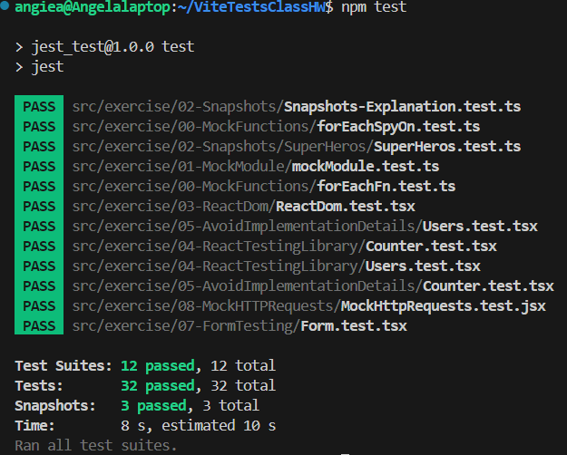

# jest_test



This project demonstrates several testing techniques using Jest, including:
- Testing React components using both ReactDOM's `createRoot` API and React Testing Library.
- Testing snapshot output.
- Using mock functions and spies.
- Testing utility functions with module mocks.

## Table of Contents

- [Overview](#overview)
- [Project Structure](#project-structure)
- [Prerequisites](#prerequisites)
- [Installation](#installation)
- [Running the Tests](#running-the-tests)
- [Test Details](#test-details)
- [Configuration](#configuration)
- [License](#license)

## Overview

This project provides examples for:
- **ReactDOM Testing:** Rendering a simple `Counter` component (which increments and decrements a count) using ReactDOM's `createRoot` API and testing its behavior.
- **React Testing Library:** Refactoring the `Counter` test so that it mimics real user interactions, and uses more specific assertions (such as `toHaveTextContent` and `toBeInTheDocument`).
- **Snapshot Testing:** Testing a set of superhero data and output using Jest snapshots.
- **Mock Functions and Spies:** Using `jest.fn()` and `jest.spyOn()` to test functions that transform data (e.g., forEach implementations and utility functions).

## Project Structure

Below is a simplified view of the project folder structure:

```
vite-project/
├── src/
│   ├── exercise/
│   │   ├── 00-MockFunctions/
│   │   │   ├── forEachFn.test.ts
│   │   │   └── forEachSpyOn.test.ts
│   │   ├── 01-MockModule/
│   │   │   └── mockModule.test.ts
│   │   ├── 02-Snapshots/
│   │   │   ├── SuperHeros/
│   │   │   │   ├── SuperHeros.test.ts
│   │   │   │   └── __snapshots__/SuperHeros.test.ts.snap
│   │   │   └── Snapshots-Explanation.test.ts
│   │   ├── 03-ReactDom/
│   │   │   ├── Counter.tsx
│   │   │   └── ReactDom.test.tsx
│   │   └── 04-ReactTestingLibrary/
│   │       └── Counter.test.tsx
├── jest.config.cjs
├── jest.setup.ts
├── package.json
├── tsconfig.json
├── tsconfig.app.json
└── tsconfig.node.json
```

## Prerequisites

- [Node.js](https://nodejs.org/) (v14+ recommended)
- npm (comes with Node.js)

## Installation

1. Clone the repository or download the project files.
2. Navigate to the project directory in your terminal.
3. Run the following command to install all dependencies:

   ```bash
   npm install
   ```

## Running the Tests

To run all tests in watch mode:

```bash
npm test
```

To generate a coverage report:

```bash
npm run test:coverage
```

You can also run tests in watch mode with:

```bash
npm run test:watch
```

## Test Details

### ReactDOM Testing (Exercise 03)

- **File:** `src/exercise/03-ReactDom/ReactDom.test.tsx`  
- **Component Under Test:** `src/exercise/03-ReactDom/Counter.tsx`  
- **What it Tests:**
  - Rendering of the `Counter` component.
  - Presence of two buttons (Increment and Decrement).
  - Functionality: clicking on the buttons updates the count displayed in the `h1`.

### React Testing Library (Exercise 04)

- **File:** `src/exercise/04-ReactTestingLibrary/Counter.test.tsx`  
- **What it Tests:**
  - Rendering the `Counter` component in a way that simulates a real user experience.
  - Uses queries like `getByRole` and assertions such as `toHaveTextContent`.
  - Simulates button clicks via `fireEvent.click`.

### Snapshot Testing (Exercise 02)

- **File:** `src/exercise/02-Snapshots/SuperHeros/SuperHeros.test.ts`  
- **What it Tests:**
  - Ensures that the output of the `getFlyingSuperHeros` function matches the saved snapshot.
  - Includes tests that verify behavior when no superhero has the "Fly" power and when filtering is applied.

### Mock Functions and Module Testing (Exercises 00 & 01)

- **Files:**  
  - `src/exercise/00-MockFunctions/forEachFn.test.ts`
  - `src/exercise/00-MockFunctions/forEachSpyOn.test.ts`
  - `src/exercise/01-MockModule/mockModule.test.ts`  
- **What they Test:**
  - Use of `jest.fn()` to create mock functions.
  - Use of `jest.spyOn()` for tracking function calls and return values.
  - Verifying that functions are called with the correct arguments and return correct results after transformations.

## Configuration

### Jest Configuration

- **File:** `jest.config.cjs`  
- Uses `ts-jest` transformer to enable TypeScript tests.
- Specifies the test environment as `jest-environment-jsdom`.
- Sets up coverage collection and thresholds.
- Loads additional setup via `jest.setup.ts`.

### TypeScript Configuration

- The project uses multiple `tsconfig` files:
  - **`tsconfig.json`** – References `tsconfig.app.json` and `tsconfig.node.json`.
  - **`tsconfig.app.json`** – Contains settings for React code (including JSX support via `"jsx": "react-jsx"` and module interop via `"esModuleInterop": true`).
  - **`tsconfig.node.json`** – Contains settings for Node-specific code and tests.

## License

This project is licensed under the ISC License.
